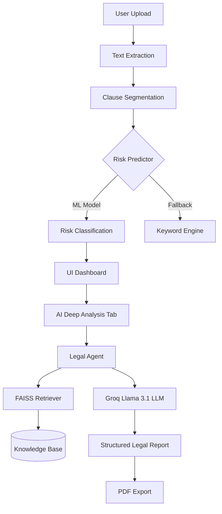

# Legal Contract Risk Analyzer & Agentic Assistant

> AI-powered, clause-level risk detection and legal assistance for contracts — built with Streamlit, scikit-learn, and Agentic AI.


---

## Overview

The **Legal Contract Risk Analyzer** is an end-to-end system for auditing legal documents. It combines classical Machine Learning (Milestone 1) for rapid risk flagging with Agentic Generative AI (Milestone 2) for deep semantic analysis, explanation, and mitigation strategy generation.

### Key Features

| Milestone | Feature | Description |
|---|---|---|
| **M1** | Multipart Upload | Supports `.pdf` and `.txt` file extraction. |
| **M1** | Smart Segmentation | Heuristic-based splitting of documents into logical clauses. |
| **M1** | ML Risk Classifier | Supervised Logistic Regression model trained to identify risky clauses. |
| **M1** | KPI Dashboard | Real-time statistics on total/risky/safe counts and risk percentage. |
| **M2** | Agentic Legal Assistant | Multi-state agent (Initializing → Retrieving → Analyzing → Reporting). |
| **M2** | RAG (Knowledge Retrieval) | FAISS-based vector search to pull relevant legal guidelines for context. |
| **M2** | Mitigation Strategies | LLM-generated actionable steps to reduce identified legal risks. |
| **M2** | Structured PDF Export | Professional PDF reports containing the full risk assessment. |

---

## Project Architecture



---

## Quick Start

### 1. Clone & Setup
```bash
git clone https://github.com/sudip-kumar-prasad/RiskContractAnalyzer.git
cd RiskContractAnalyzer
python -m venv venv
source venv/bin/activate
pip install -r requirements.txt
```

### 2. Configure API Keys
Create a `.streamlit/secrets.toml` file:
```toml
GROQ_API_KEY = "your_groq_api_key"
```

### 3. Train the Model (Optional - Pre-trained included)
```bash
python train_classifier.py
```

### 4. Run the App
```bash
streamlit run app.py
```

---

## How it Works

1.  **Preprocessing**: Documents are cleaned and split using regex-based clause boundary detection (`utils/clause_segmenter.py`).
2.  **Classification**: Each clause is vectorized via TF-IDF and passed through a Logistic Regression model to determine if it's "Risky" or "Safe".
3.  **Agentic Logic**: The `LegalAgent` manages a state-aware workflow. It uses `sentence-transformers` to embed clauses and search the `data/knowledge_base/` via FAISS for supporting legal precedents.
4.  **Generation**: The Groq API (Llama 3.1) synthesizes the clause text and retrieved guidelines to generate persistent risk assessments and mitigation plans.

---

## Documentation
- [Problem Understanding](docs/problem_understanding.md)
- [Input-Output Specification](docs/input_output_specification.md)
- [Model Evaluation Report](docs/model_evaluation_report.md)
- [Deployment Guide](docs/deployment_guide.md)

---

## Disclaimer
This tool is for **demonstration purposes only** and does not constitute legal advice. Always consult a qualified lawyer before signing any contract.
