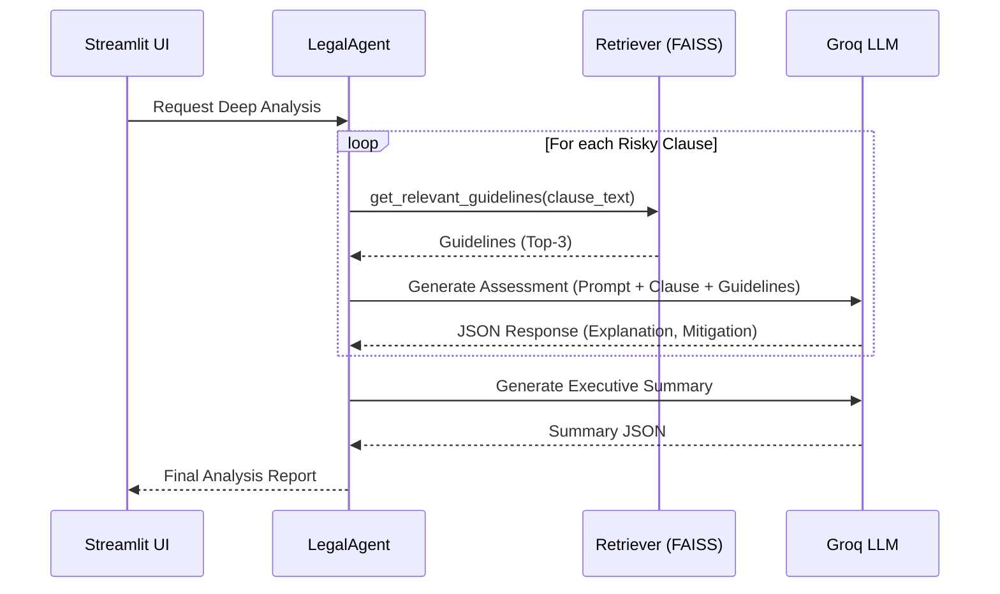

# Input-Output Specification — Agentic Edition

This document defines the formal data contracts for both the **ML Classification pipeline** and the **Agentic Legal Assistant**.

---

## 1. System Inputs

| Source | Specification |
|---|---|
| **Primary Document** | `.pdf` or `.txt` contract file (UTF-8) |
| **Knowledge Base** | Local JSON files in `data/knowledge_base/` containing legal guidelines. |
| **Agent Parameters** | API Key (`GROQ_API_KEY`) and Model (`llama-3.1-8b-instant`). |

---

## 2. Milestone 1: Classification Outputs

For every segmented clause, the ML pipeline produces:

| Field | Type | Description |
|---|---|---|
| `clause_id` | `int` | Unique sequence ID. |
| `text` | `str` | Raw clause string. |
| `label` | `str` | "Risky" or "Safe" (determined by ML Classifier). |
| `confidence` | `float` | Probability score from 0.0 to 1.0. |
| `predictor` | `str` | Identifies if "ML Model" or "Rule-Based" fallback was used. |
| `categories` | `list` | High-level risk categories (Indemnity, Termination, etc.). |

---

## 3. Milestone 2: Agentic Analysis Outputs

When a user triggers "Deep Analysis," the **Legal Agent** generates a structured report with the following fields:

### 3.1 Metadata Summary
| Field | Type | Description |
|---|---|---|
| `contract_summary` | `str` | High-level executive overview of the total contract risk profile. |
| `legal_disclaimer` | `str` | Standard ethical and professional disclaimer for AI output. |

### 3.2 per-Clause AI Assessment
For each flagged risky clause, the agent provides:

| Field | Type | Description |
|---|---|---|
| `risk_severity` | `enum` | **High**, **Medium**, or **Low** intensity. |
| `explanation` | `str` | Detailed semantic reasoning on *why* the clause is risky. |
| `mitigation` | `str` | Actionable legal or business recommendations to lower the risk. |
| `relevant_guidelines` | `list` | Excerpts from the Knowledge Base retrieved via RAG. |

---

## 4. Internal Data Workflow (Agentic)

---

## 5. UI Rendering Contract

- **KPI Metrics**: Overall risk percentage and clause counts.
- **Visual Mapping**: 
    - **High Severity**: Red Border + "Critical Risk" tag.
    - **Medium Severity**: Orange Border + "Warning" tag.
    - **Low Severity**: Green Border + "Advisory" tag.
- **Export**: Valid cross-compatible PDF containing summary stats and all AI-generated mitigations.

---

## 6. Error & Edge Case Handling

| Scenario | System Input / Response |
|---|---|
| **No Risky Clauses** | UI prevents Agent trigger; informs user no deep analysis is needed. |
| **API Failure** | System catches `HTTPError`; returns fallback explanation "Analysis failed due to API timeout." |
| **RAG Empty Results** | Agent proceeds with analysis based purely on the clause and persona-knowledge. |
| **Malformed PDF** | `PyPDF2` error caught; informs user to try a plain `.txt` file. |
