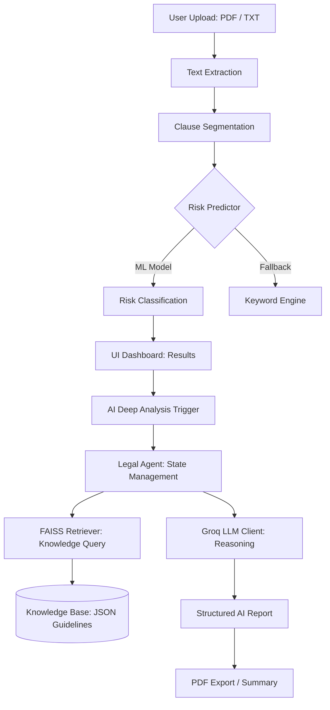

# System Architecture Diagram — Agentic Legal Assistant

This document provides a representation of the integrated system architecture, combining the Milestone 1 ML pipeline with the Milestone 2 Agentic AI and RAG components.

---

## High-Level Integrated Pipeline

---

## Detailed Component Breakdown

### 1. Presentation Layer (Streamlit)
- **Dashboard (`app.py`)**: Central hub managing user interaction, file uploads, and visualization tabs.
- **UI Components (`components/result_display.py`)**: Specialty cards for ML predictions and AI assessments.

### 2. ML Classification Layer (Milestone 1)
- **Feature Extraction (`src/model_training/feature_extractor.py`)**: Converts raw text into TF-IDF vectors.
- **Predictor (`utils/risk_predictor.py`)**: Orchestrates the use of pre-trained scikit-learn models (`LogisticRegression`) or rule-based fallbacks.

### 3. Agentic AI Layer (Milestone 2)
- **Legal Agent (`src/agents/legal_agent.py`)**: An explicit state-machine (Initializing → Retrieving → Analyzing → Reporting) that handles the complex reasoning workflow.
- **LLM Client (`utils/llm_client.py`)**: A connection to the Groq API utilizing the `llama-3.1-8b-instant` model for high-speed, cost-free legal processing.
- **Prompt Strategies (`src/agents/prompts.py`)**: Senior Legal Counsel personas and structured JSON output templates to prevent hallucination.

### 4. RAG & Knowledge Layer
- **Knowledge Base (`data/knowledge_base/`)**: A curated library of legal guidelines in JSON format across five domains (Indemnity, Termination, IP, etc.).
- **Retriever (`utils/retriever.py`)**: Uses `sentence-transformers` for embedding and **FAISS** for ultra-fast vector similarity search to grounded the LLM's reasoning in established legal principles.

---

## Technology Stack Summary

| Layer | Technologies |
|---|---|
| **Frontend** | Streamlit, Custom CSS |
| **NLP Preprocessing** | NLTK, spaCy, Python `re`, PyPDF2 |
| **Machine Learning** | scikit-learn, joblib |
| **Agentic AI** | Groq API, Structured JSON |
| **Vector DB / RAG** | FAISS, sentence-transformers |
| **Knowledge Store** | JSON flat files |
| **Document Export** | fpdf (cross-compatible) |

---

## Data Flow Map

1.  **File Upload**: User provides a document.
2.  **Segmentation**: Text is split into discrete clauses.
3.  **ML Audit**: Every clause is run through a Logistic Regression classifier to flag "Risky" vs "Safe".
4.  **Deep Analysis**: For flagged risky clauses, the **Legal Agent** takes over.
5.  **Contextual Retrieval**: The agent retrieves the top-K most relevant legal guidelines from the FAISS index.
6.  **Reasoning**: The LLM synthesizes the specific clause text and retrieved guidelines to generate an explanation and a mitigation strategy.
7.  **Reporting**: A final structured report is generated and displayed to the user via an interactive card interface.
8.  **Export**: The entire audit can be downloaded as a professional PDF.
